# GAN

### 1. 什么是GAN

​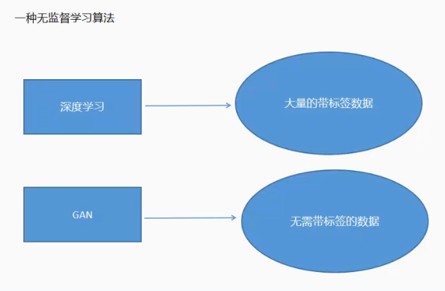​

	这里举一个例子：

* 水平不高的小偷被抓，为了生存，不断提到水平
* 为了抓高水平的校友，警察也需要不断提升自己

​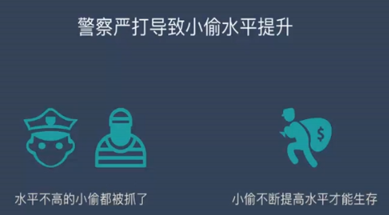​

	根据上面的例子GAN（生成对抗网络）由两个重要的部分组成：

​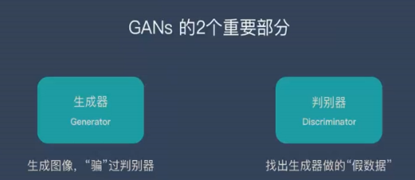​

* 第一阶段：固定生成器，训练判别器（生成器所生成的东西需要骗过判别器，先提升判别器水平，才能更好的训练生成器）
* 第二阶段：训练生成器，固定判别器
* 循环一、二阶段

​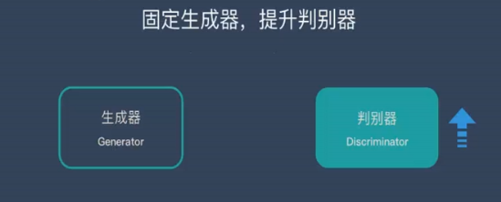​

​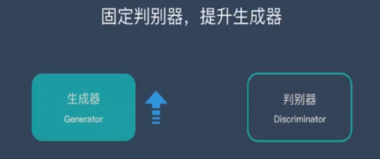​

​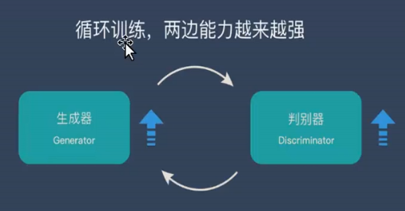​

### 2. GAN的用途

* 生成数据集

​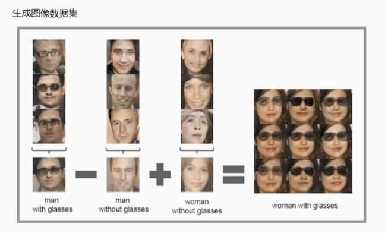​

* 生成图像、漫画

​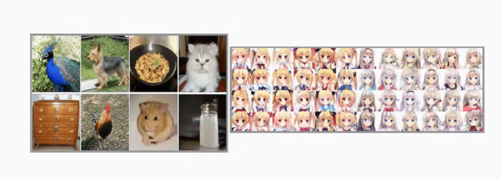​

* 生成指定风格的图像

​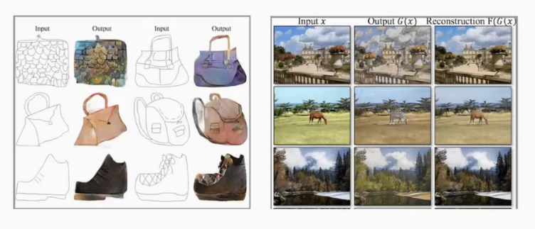​

* 文字到图像的转换

​​

* 语义分割到图片的转换

​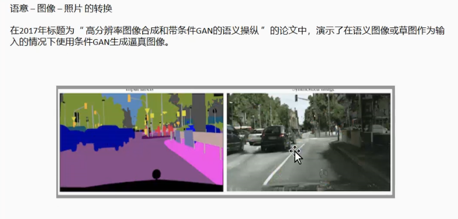​

* 自动生成模特

​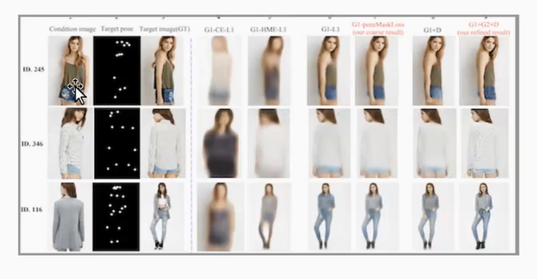​

* 自动生成3D模型

​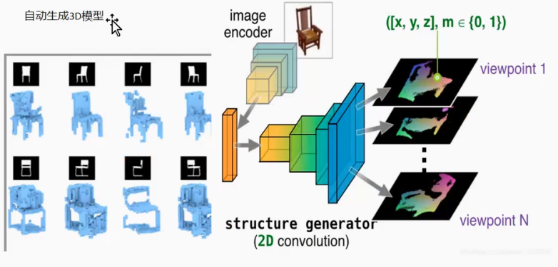​

* ......

### 3. MVTec AD数据集

* 训练集只包含正常的样本
* 测试集包含正常样本与缺陷样本

	用于无监督的训练

​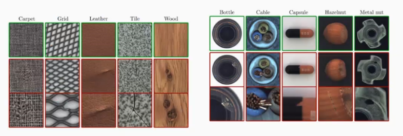​

‍
