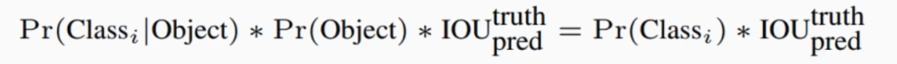

# YOLO v1

# YOLO v1

	从R-CNN到Faster R-CNN均是**基于proposal+分类**来完成目标检测，**检测精度较高，但是检测速度却不行**。YOLO提供了一种全新的思路：**直接将bounding box的位置和所属类别的置信度进行回归**。

* 速度快，能够达到实时性能的要求
* 使用全图context信息，背景错误较少
* 泛化能力强

处理流程：

* 将图像进行resize操作
* 将图像送入单个卷积网络
* 对模型的检测结果进行nms操作

​​

	YOLO v1的核心思想就是**Unified Detection（统一检测），** 将目标检测的分离组件组合为单个神经网络。

* 将图像划分为s*s个grid cell，object的中心点在grid cell内，那么这个grid cell就负责预测这个object
* 每个grid cell需要预测B个boxes（x，y，w，h）以及conf

  * boxes（x，y，w，h）是目标中心点坐标及宽高对于图像宽高的比值
  * conf反应的是bounding box中包含目标可能性的大小

    ​​
* 每个grid cell还需要预测C个类别的概率

  * 注意：conf是判断bounding box中是否包含目标，而类别概率则是判断这个grid cell是属于哪一个类别
* 将得到的conf以及类别概率相乘

  ​​

**注意：** 在YOLO v1中，并没有anchor的概念提出，它是直接产生S * S * B个bounding box，并没有参照任何的anchor，这也造成了YOLO v1对边框的回归精度不高，但是速度却较快

​​

* 分类处理类别的概率，低于设置score的置为0
* 做nms处理，将重叠框的概率类别置为0
* 判断每个框类别概率最大的

​​

​​

**注意：** YOLO v1针对小目标并不友好。分析流程，两个小目标（同类）可能存在于同一个grid cell中，根据上面的处理，会先将置信度低的目标排除掉，同时，在进行nms时，会将两个靠近的框排除掉一个，而小目标可能共存在一个grid cell中，导致两者的iou过大从而被排除掉

​​
