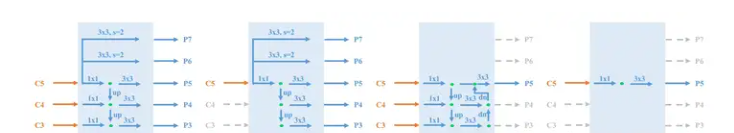
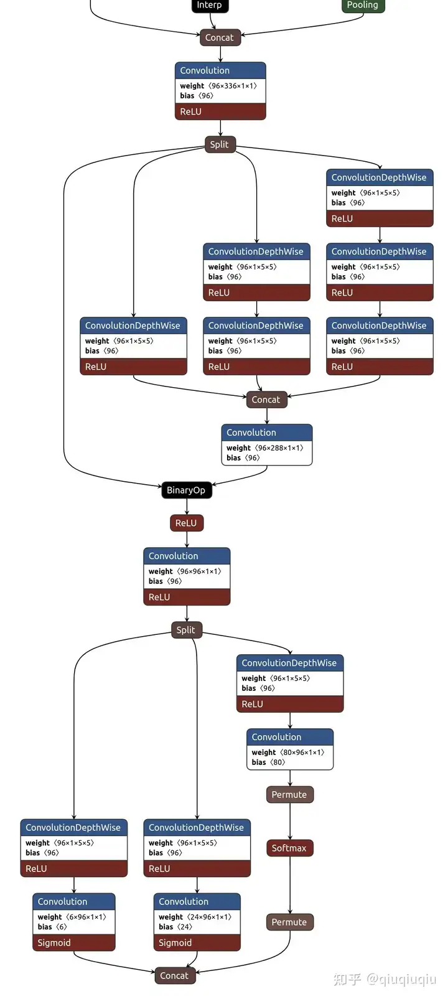

# FastestDet

### 网络结构
##### backbone
模型的backbone采用了轻量化的卷积模型shufflenetv2-0.5x，**将得到的三个尺寸的特征统一尺寸进行cat操作**(yolof证明了使用单个c5的特征图并不会对检测的结果带来过大的损失，但是作者这里依旧将三个尺寸的特征融合为了一个，以此替代fpn融合不同尺寸特征的作用)

##### yolof
在进行后续的分析之前，首先需要了解yolof，作者在neck与head部分的改动借鉴了yolof的思想
- fpn
  - 多尺度特征融合

  - 分治策略，不同大小的目标分配到不同大小的的输出层上，克服尺度预测问题

    

将fpn抽象为以下4种结构：

分析以上四种4种结构MiMo、SiMo、MiSo和SiSo，其中MiMo是标准的FPN结构，输入和输出都包均包含多尺度的特征。

- 从mAP角度分析，SiMo结果和MiMo差距不大，说明C5有足够的能力检测不同尺寸的目标，而 MiSo和SiSo则和MiMo差距较大，说明FPN分治优化作用远远大于多尺度特征融合
- 由于MiMo结构由于存在高分辨率特征图C3会带来较大的计算量，并且拖慢速度

综上所示，可以得到一些结论：

- FPN模块的主要增益来自于其分治优化手段，而不是多尺度特征融合
- FPN模块中存在高分辨率特征融合过程，导致消耗内存比较多，训练和推理速度也比较慢，对部署不太优化
- 如果想在抛弃FPN模块的前提下精度不丢失，那么主要问题是提供分治优化替代手段

- 如果采用不同空洞率的叠加，则可以有效避免上述问题

为此yolof设计了Dilated Encoder结构，串联多个不同空洞率的模块以覆盖不同大小物体，改善感受野单一问题

##### neck
在yolof的分析中可以得知，更加需要的是不同尺寸下的特征来进行预测（小尺寸对应大目标，大尺寸对应小目标），如果采用了单一尺寸的检测头，必然会带来精度上的损失。不同于yolof采用的不同空洞率卷积串联，作者在neck部分采用的是SPP的并行结构，由不同数量的5*5的卷积分支并行而成，融合不同感受野的特征

感受野的计算：[CNN感受野最全计算公式_感受野计算公式-CSDN博客](https://blog.csdn.net/weixin_45199303/article/details/109004627)

##### head
head部分采用了单个尺寸的输出头

分析整个网络架构，对比常见的目标检测都有对应不同尺寸的检测头，高分辨率检测头检测小目标，低分辨检测头检测大目标，其根本原因在于不同尺度的目标所需要的感受野不同，而模型每层的感受野不同。而在当前的网络结构中，采用了SPP的并行结构并行拥有不同数量的5*5卷积分支，融合不同感知野的特征，让单个检测头也能适应检测不同尺度的物体。

### 损失构建

10.10debug代码

### 正负样本分配

10.10debug代码

### 数据增强

采用了简单的random_crop与random_narro，对于轻量型的模型来说，学习能力不足，使用马赛克之类过于复杂的增样方法，可能会导致模型的效果出现问题。

这里还需要注意一点，在统一尺寸时，采用了直接resize的方法，而不是按比例resize之后再进行pad操作（对于二者之间的差距可以参考下面的文章[图像Resize方式对深度学习模型效果的影响 - 知乎 (zhihu.com)](https://zhuanlan.zhihu.com/p/362701716)）