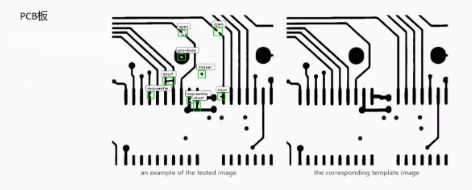
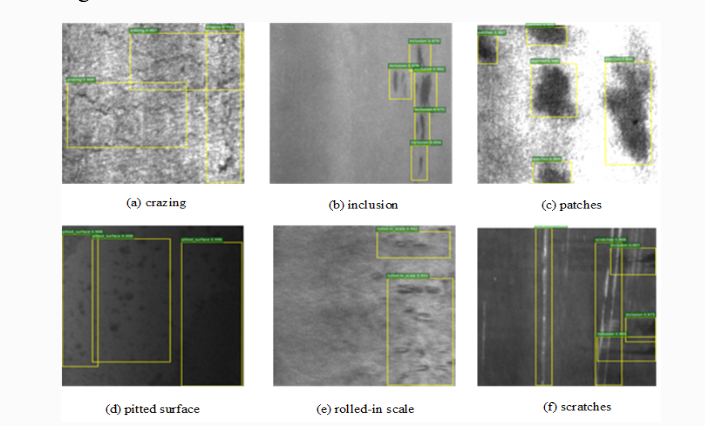
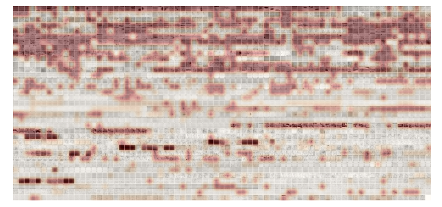
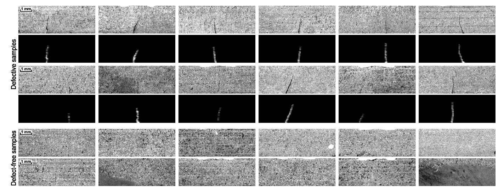
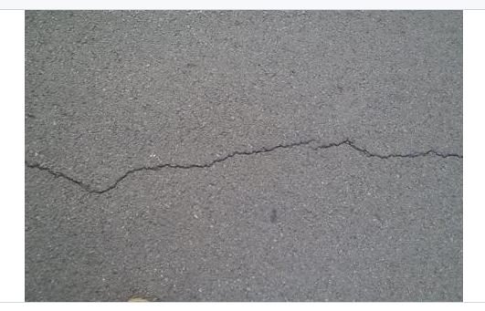
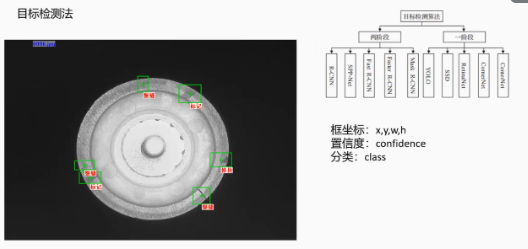
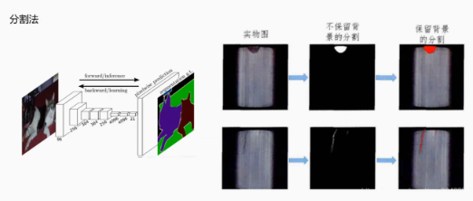
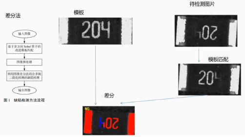
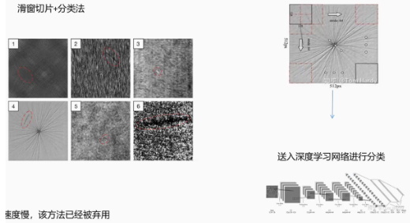

# 缺陷检测

### 1. 缺陷检测简介

##### 1.1 什么是缺陷检测

	缺陷检测通常是指对物品表面缺陷的检测，采用计算机视觉技术对工件表面的半点、凹坑、色车等缺陷进行检测。

##### 1.2 为什么采用计算机视觉完成缺陷检测？

* 人工检测速度慢、效率低、无法满足自动化产线
* 人工检测精度低，无法识别微米级别的缺陷

	对比传统的人工方式，采用计算机视觉识别的方法速度提升5-10倍，所见50%人力。

##### 1.3 工业检测发展史

* 人工质检
* 传统机器视觉
* 深度学习

	传统机器视觉与深度学习对比

||传统机器视觉|深度学习|
| ------| --------------------------------------| --------------------------|
|优点|适应纹理、形态简单的目标，需要数据少|适应纹理、形态复杂的目标|
|缺点|对复杂缺陷处理能力差，抗干扰能力差|需要数据多|

##### 1.4 缺陷检测的应用场景

* 3C
* 汽车
* 家电
* 机械制制造
* ......

​​

##### 1.5 缺陷检测难点

* 缺陷种类多：例如液晶面板的缺陷高达120种，最缺陷的定义、分类以及标注工作难度高
* 缺陷样本难收集：产线上绝大部分的产品均为合格品，次品数量少
* 类内缺陷差异大，类间缺陷却有相似的点
* 待检物品表面光滑，考验光源的设计

##### 1.6 缺陷检测数据集介绍

* 东北大学数据集

  * [东北大学主页平台 宋克臣--中文主页--NEU surface defect database](http://faculty.neu.edu.cn/songkechen/zh_CN/zdylm/263270/list/index.htm)
  * 六种缺陷：

    * 轧入氧化皮
    * 斑块
    * 银斑
    * 麻点表面
    * 夹杂物
    * 划痕
  * ​​
* 太阳能板

  * [zae-bayern/elpv-dataset: A dataset of functional and defective solar cells extracted from EL images of solar modules (github.com)](https://github.com/zae-bayern/elpv-dataset)
  * 300*300像素8位灰度图的太阳能电池样本
  * ​​
* kolektorSSD

  * [Kolektor Surface-Defect Dataset (KolektorSDD/KSDD) | ViCoS Lab](https://www.vicos.si/resources/kolektorsdd/)
  * 包含50种偏向转换器的缺陷
  * ​​
* 水泥道路裂缝数据集

  * [cuilimeng/CrackForest-dataset (github.com)](https://github.com/cuilimeng/CrackForest-dataset)
  * ​​
* 桥梁裂缝数据集

  * [桥梁裂缝图像数据_数据集-飞桨AI Studio星河社区 (baidu.com)](https://aistudio.baidu.com/datasetdetail/97847/0)
* 天池铝材表面缺陷数据集

  * [铝型材缺陷检测数据集APDDD_数据集-阿里云天池 (aliyun.com)](https://tianchi.aliyun.com/dataset/148297)

##### 1.7 缺陷检测常用方法

* 目标检测法

  * ​​
* 分割法

  * ​​
* 差分法

  * ​​
* 滑窗切片+分类法

  * ​​
